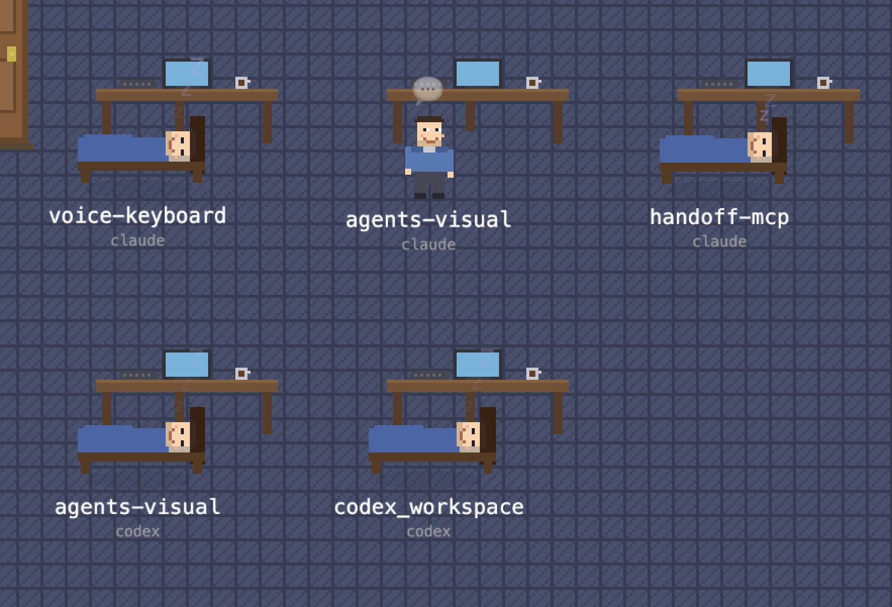

# AgentVille

A real-time visualization dashboard for AI coding agents. It discovers running **Claude Code** and **OpenAI Codex** sessions on your machine and renders each agent as a pixel-art sprite in a themed isometric scene, showing what every agent is doing at a glance.



## Features

- **Live multi-provider discovery** — Claude Code sessions (via `~/.claude/sessions/`) and Codex sessions (via `pgrep` + `lsof` on live `codex` processes) are streamed via SSE and rendered side-by-side in the same scene
- **Pluggable provider architecture** — every agent is represented by a single shared `Agent` interface using a neutral action vocabulary (`reading` / `editing` / `executing` / `thinking` / `writing` / `delegating` / `waiting` / `idle`). Adding a new source (Gemini CLI, Cursor, …) is one new provider class + one `register()` call — no changes to the stream, store, or scene
- **Pixel-art scene** — agents are animated sprites on a PixiJS tilemap; emotes update in real time as each agent works
- **Themes** — switch between Office, Farm, and Workshop tile sets
- **Side panel** — click an agent to inspect its full id (`<provider>:<sessionId>`), current action, host app, working directory, subagents, and recent transcript
- **Double-click to focus** — brings the agent's host terminal or IDE window to the front (macOS)
- **Resizable layout** — drag the handle between the scene and the side panel

## Tech Stack

- **Next.js 16** / React 19
- **PixiJS 8** + `@pixi/react` for the 2D scene
- **Zustand** for state management
- **Tailwind CSS 4** + shadcn/ui components
- **Vitest** (unit) + **Playwright** (E2E)

## Install

### Homebrew (macOS)

```bash
brew tap sihekuang/agentville https://github.com/sihekuang/agentville.git
brew install agentville
```

Then run:

```bash
agentville
```

Open [http://localhost:4200](http://localhost:4200). To use a different port:

```bash
AGENTVILLE_PORT=8080 agentville
```

Or run as a background service:

```bash
brew services start agentville
```

### From source

```bash
npm install
npm run dev
```

Open [http://localhost:4200](http://localhost:4200). The app will automatically discover any running Claude Code or Codex sessions.

### macOS Accessibility Permission

The **Focus** feature uses AppleScript and System Events to raise the specific window matching an agent's project. For this to work, the app that runs the dev server (Terminal, iTerm2, Warp, VS Code, etc.) must be granted Accessibility access:

1. Open **System Settings > Privacy & Security > Accessibility**
2. Click **+** and add the terminal/IDE you use to run `npm run dev`

Without this permission, clicking Focus will still activate the host application, but it won't be able to target the specific project window.

## Scripts

| Command | Description |
|---------|-------------|
| `npm run dev` | Start the development server |
| `npm run build` | Production build |
| `npm run start` | Serve the production build |
| `npm run lint` | Run ESLint |
| `npm test` | Run unit tests (Vitest) |
| `npm run test:watch` | Run unit tests in watch mode |
| `npm run test:e2e` | Run end-to-end tests (Playwright) |

## Project Structure

```
src/
  app/                # Next.js app router (pages, API routes)
    api/agents/       # SSE stream + focus endpoint
  components/
    scene/            # PixiJS scene, tilemap, agent sprites, theme config
    ui/               # Header, SidePanel, action list, status badge
  hooks/              # useAgentStream (SSE client)
  lib/
    providers/        # Agent / AgentProvider / ProviderRegistry; ClaudeCodeProvider; CodexProvider
    codex/            # Codex rollout parser + pgrep/lsof process discovery
    sessions.ts       # Claude session discovery
    transcript.ts     # Claude transcript parsing
    host-app.ts       # Resolve agent PID → host terminal/IDE for focus
  store/              # Zustand store (agents, theme, selection)
public/
  sprites/            # Pixel-art tile and character PNGs per theme
```

See [`AGENTS.md`](AGENTS.md) for the architecture principles (uniform `Agent` interface, SOLID, pluggable datasources).
